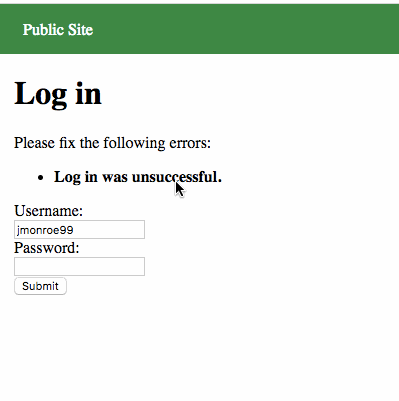
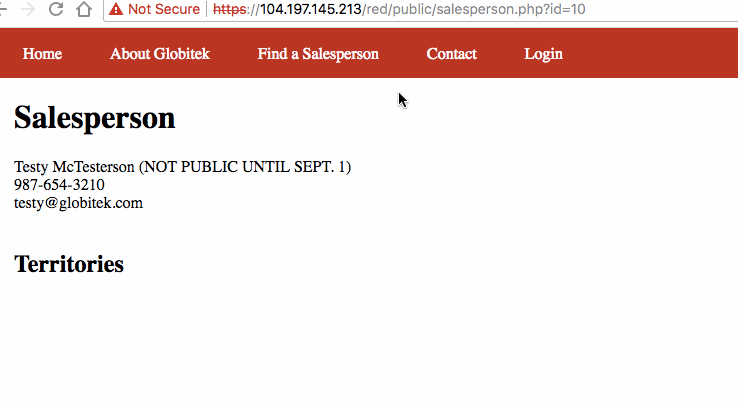
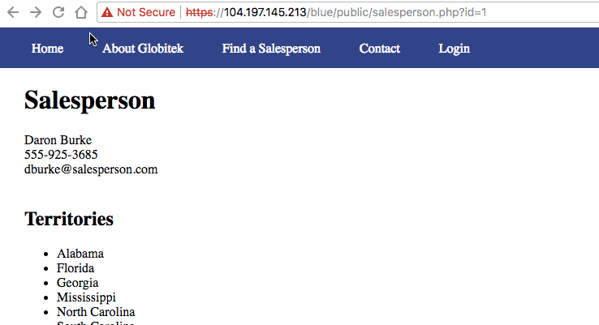
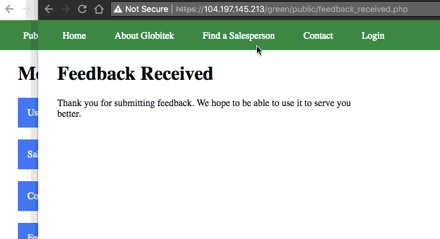
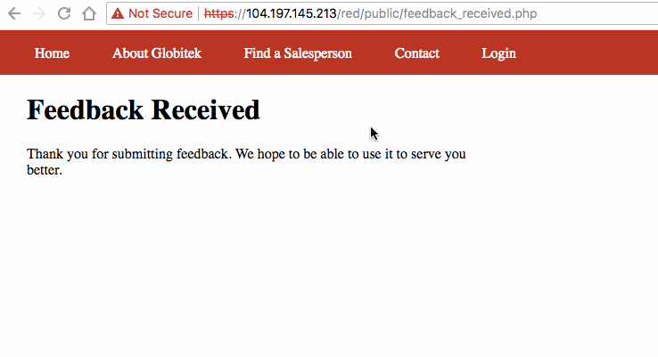
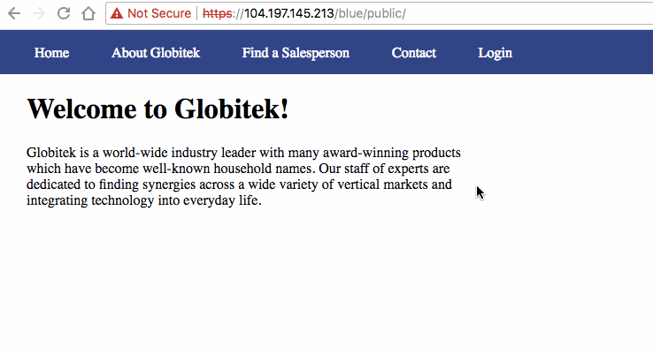

# Week-08-Web-Security

1. Username Enumeration
  * 
2. Insecure Direct Object Reference
  * 
3.  SQL Injection
  * 
4. Cross-Site Scription
  * 
5. Cross-Site Request Forgery
  * 
6. Session Hijacking
  * 
